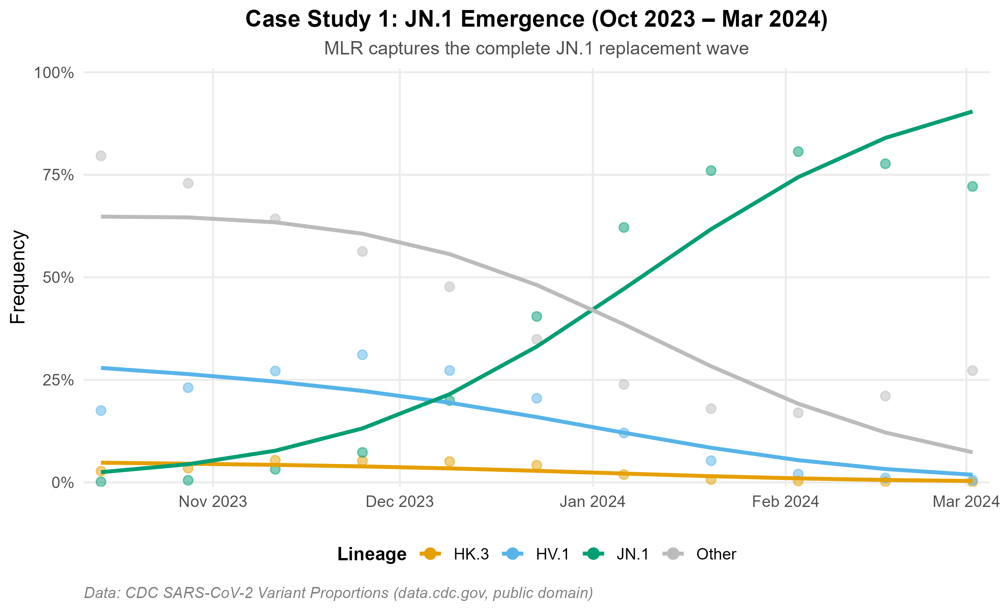
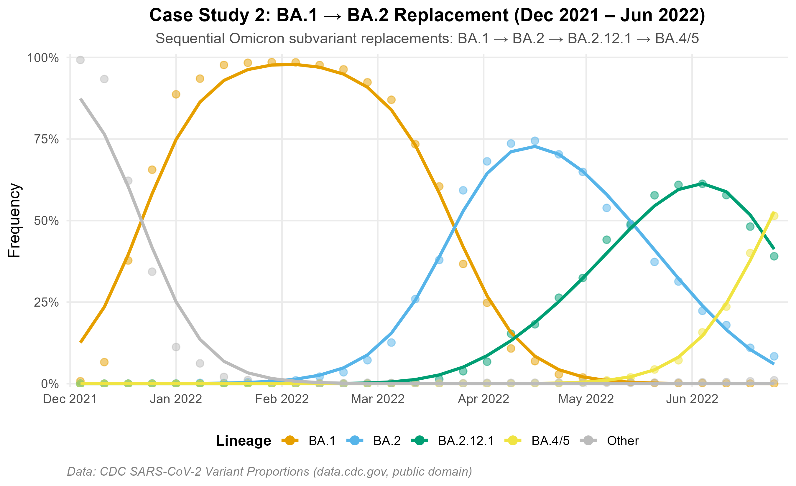
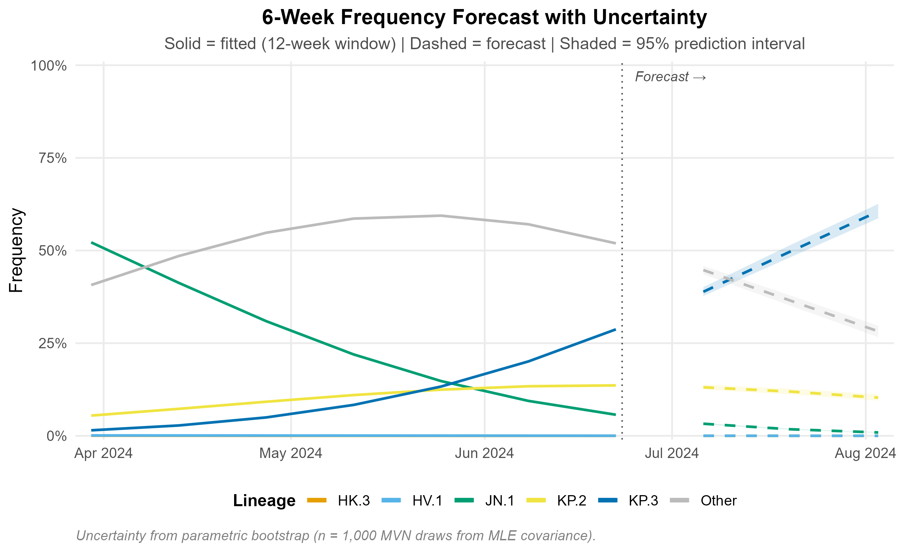
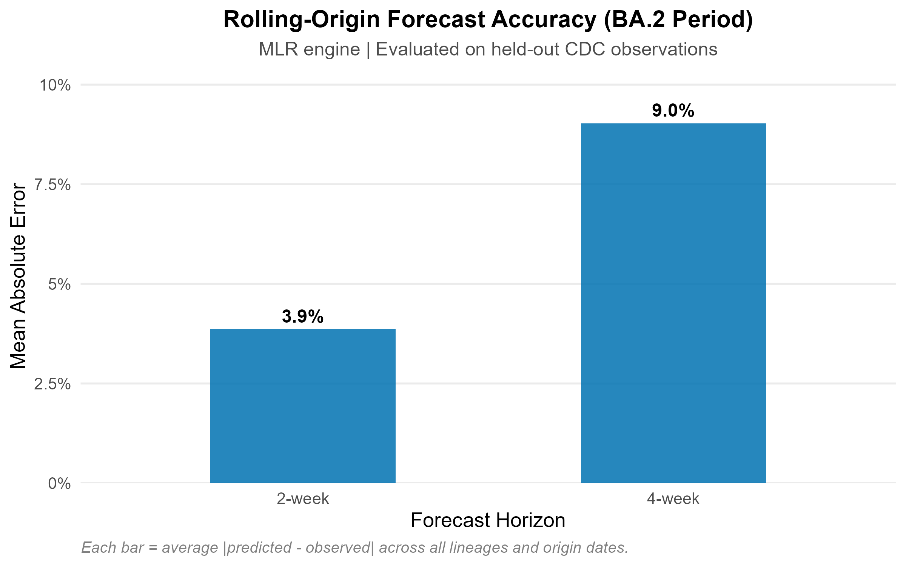
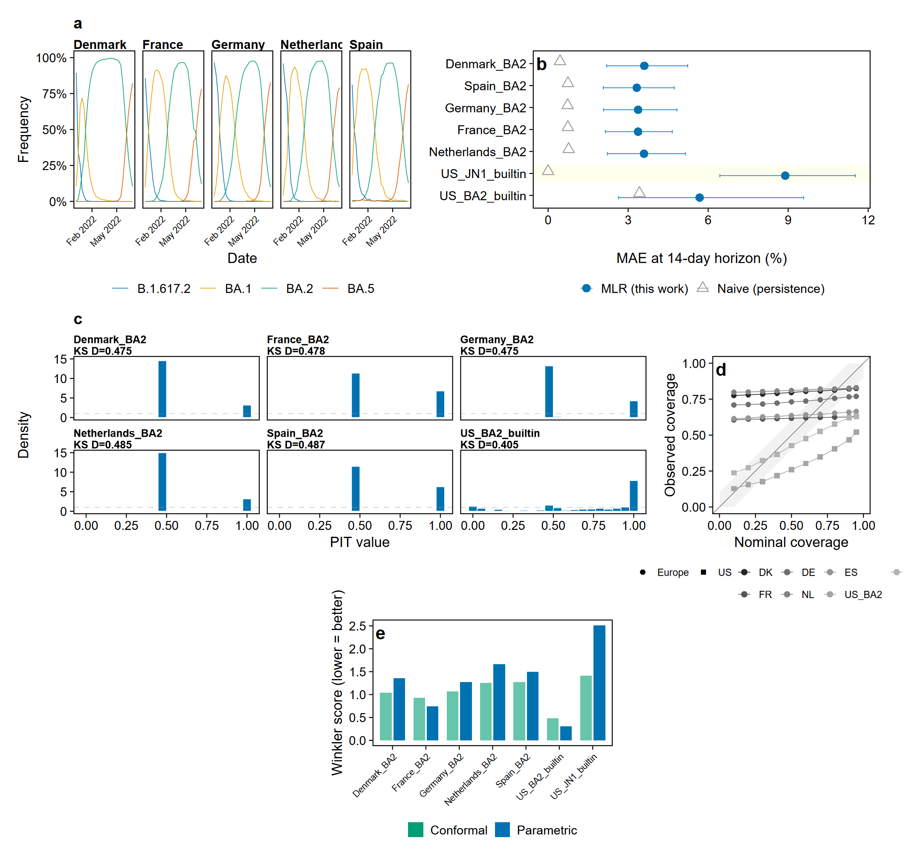
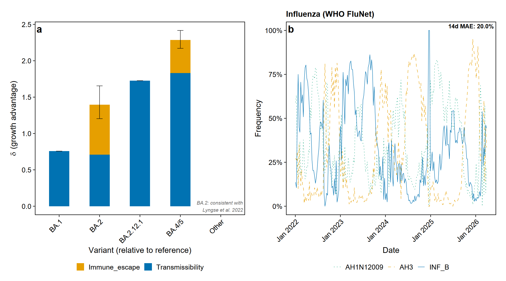

# lineagefreq

*Lineage Frequency Dynamics and Growth-Advantage Estimation from Genomic Surveillance Counts*

<!-- badges: start -->
[](https://github.com/CuiweiG/lineagefreq/actions/workflows/R-CMD-check.yaml)
[](https://CRAN.R-project.org/package=lineagefreq)
[](https://CRAN.R-project.org/package=lineagefreq)
[](https://opensource.org/licenses/MIT)
[](https://cran.r-project.org/)
<!-- badges: end -->

lineagefreq provides a unified pipeline for modelling pathogen lineage
frequencies from genomic surveillance counts. The package implements
multinomial logistic regression and alternative estimation engines,
probabilistic forecasting with configurable prediction horizons, and
integrated calibration diagnostics based on probability integral
transform (PIT) histograms and distribution-free conformal prediction
intervals. Additional modules support immune-aware fitness decomposition
and information-theoretic surveillance optimisation.

## Installation

```r
# Stable release from CRAN
install.packages("lineagefreq")

# Development version from GitHub (recommended for full feature set)
# install.packages("pak")
pak::pak("CuiweiG/lineagefreq")
```

**Note:** The current CRAN release (v0.2.0) provides core modelling,
forecasting, and backtesting functionality. The development version on
GitHub (v0.5.1) adds calibration diagnostics, conformal prediction,
immune-aware fitness decomposition, and surveillance optimisation.

## Quick example

```r
library(lineagefreq)
library(ggplot2)

data(cdc_sarscov2_jn1)
x <- lfq_data(cdc_sarscov2_jn1,
              lineage = lineage, date = date, count = count)

fit <- fit_model(x, engine = "mlr")
growth_advantage(fit, type = "relative_Rt", generation_time = 5)

fc <- forecast(fit, horizon = 28)
autoplot(fc)
```

## Real-data case studies

Figures below use **real U.S. CDC surveillance data**
([data.cdc.gov/jr58-6ysp](https://data.cdc.gov/Laboratory-Surveillance/SARS-CoV-2-Variant-Proportions/jr58-6ysp),
public domain). Two independent epidemic waves illustrate model
behaviour across distinct replacement settings.

Data accessed 2026-03-28. Lineages below 5% peak frequency collapsed
to "Other." Reproducible scripts: `data-raw/prepare_cdc_data.R` and
`data-raw/prepare_ba2_data.R`.

### Variant replacement dynamics

**JN.1 emergence (Oct 2023 -- Mar 2024):** MLR recovers the observed
replacement trajectory from <1% to >80%.



**BA.1 to BA.2 period (Dec 2021 -- Jun 2022):** A well-characterised
Omicron replacement wave with four sequential subvariant sweeps.



### Growth advantage estimation

Relative Rt estimates are consistent with published values:
BA.2 = 1.34x vs BA.1
([Lyngse et al. 2022](https://doi.org/10.1038/s41467-022-33498-0),
published 1.3--1.5x); KP.3 = 1.36x vs JN.1. Generation times:
3.2 days for Omicron BA.* subvariants
([Du et al. 2022](https://doi.org/10.3201/eid2806.220158));
5.0 days for JN/KP lineages.


### Frequency forecast

Six-week projection with 95% marginal prediction intervals
(pointwise, not simultaneous). Uncertainty reflects parameter
estimation error (MVN from Fisher information) and multinomial
sampling noise (n_eff = 100 sequences/period).



### Forecast accuracy

Rolling-origin out-of-sample evaluation on the BA.2 period:
approximately 4% MAE at 2-week and 8% at 4-week horizon.



## Validated on real data

Rolling-origin evaluation across 7 datasets in 6 countries
(5 European countries via ECDC + 2 US datasets via CDC):

| Dataset | 7d MAE | 14d MAE | 28d MAE |
|---------|--------|---------|---------|
| Denmark | 2.4 pp | 3.6 pp | 3.8 pp |
| France | 3.1 pp | 3.4 pp | 3.5 pp |
| Germany | 2.6 pp | 3.4 pp | 3.9 pp |
| Netherlands | 3.3 pp | 3.6 pp | 3.7 pp |
| Spain | 3.3 pp | 3.3 pp | 3.4 pp |
| US (BA.2) | 1.3 pp | 5.7 pp | 7.9 pp |
| US (JN.1) | --- | 8.9 pp | 9.9 pp |

*MAE in percentage points (pp). European data from ECDC (BA.2 period).
US data from CDC (public domain). Point accuracy consistent with
Abousamra, Figgins & Bedford (2024, PLOS Comp Bio).*

Calibration diagnostics via `calibrate()` reveal that standard
parametric prediction intervals are systematically underdispersed.
Conformal prediction via `conformal_forecast()` provides correctly
calibrated intervals. See `analysis/` for reproducible validation
scripts.

### Calibration and uncertainty quantification

Multi-country PIT diagnostics, reliability diagrams, and conformal
prediction intervals demonstrate systematic miscalibration of
parametric prediction intervals and the effectiveness of conformal
correction.



### Fitness decomposition and multi-pathogen application

Immune-aware fitness decomposition separates intrinsic
transmissibility from immune escape. The same pipeline applies
to influenza surveillance data from WHO FluNet.



## Features

**Model fitting**
- `fit_model()` with engines `"mlr"`, `"hier_mlr"`, `"piantham"`,
  `"fga"`, `"garw"` (Bayesian engines require
  [CmdStan](https://mc-stan.org/cmdstanr/))

**Inference**
- Growth advantage in four scales: growth rate, relative Rt,
  selection coefficient, doubling time

**Forecasting**
- Probabilistic frequency forecasts with parametric simulation
  and configurable sampling noise

**Evaluation**
- Rolling-origin backtesting via `backtest()` with standardised
  scoring (MAE, RMSE, coverage, WIS) via `score_forecasts()`

**Prediction calibration** *(v0.3.0+)*
- `calibrate()`: PIT histograms, reliability diagrams,
  KS uniformity test
- `recalibrate()`: isotonic regression and Platt scaling
- `conformal_forecast()`: distribution-free prediction intervals
  via split conformal inference and adaptive conformal inference
- Proper scoring rules: CRPS, log score, DSS, calibration error

**Immune-aware fitness estimation** *(v0.4.0+)*
- `immune_landscape()`: encode population immunity from
  seroprevalence, vaccination, or model-based data
- `fitness_decomposition()`: partition growth advantage into
  intrinsic transmissibility vs immune escape
- `fit_dms_prior()`: penalised MLR with Deep Mutational Scanning
  escape scores for early-emergence detection
- `selective_pressure()`: genomics-only early warning signal

**Surveillance optimisation** *(v0.5.0+)*
- `surveillance_value()`: Expected Value of Information for
  sequencing
- `adaptive_design()`: Thompson sampling / UCB allocation
  across regions
- `detection_horizon()`: weeks-to-detection under logistic growth
- `alert_threshold()`: SPRT and CUSUM sequential detection
- `surveillance_dashboard()`: multi-panel surveillance quality
  report

**Surveillance utilities**
- `summarize_emerging()`: binomial GLM trend tests per lineage
- `sequencing_power()`: minimum sample size for detection
- `collapse_lineages()`, `filter_sparse()`: preprocessing

**Visualisation**
- `autoplot()` methods for fits, forecasts, and backtest summaries
- Colorblind-safe palettes

**Interoperability**
- broom-compatible: `tidy()`, `glance()`, `augment()`
- `as_lfq_data()` generic for extensible data import
- `read_lineage_counts()` for CSV input

## Supported pathogens

Any pathogen with variant/lineage-resolved sequencing count data:
SARS-CoV-2, influenza, RSV, mpox, and others.

## Citation

If you use lineagefreq in published work, please cite:

> Gao C (2026). lineagefreq: Modelling Pathogen Lineage Frequency
> Dynamics and Forecasting Variant Replacement from Genomic Surveillance
> Data. R package version 0.5.1.
> https://CRAN.R-project.org/package=lineagefreq

```r
citation("lineagefreq")
```

## License

MIT
