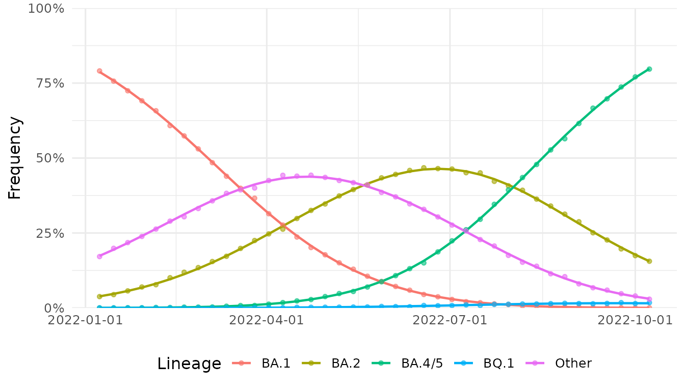
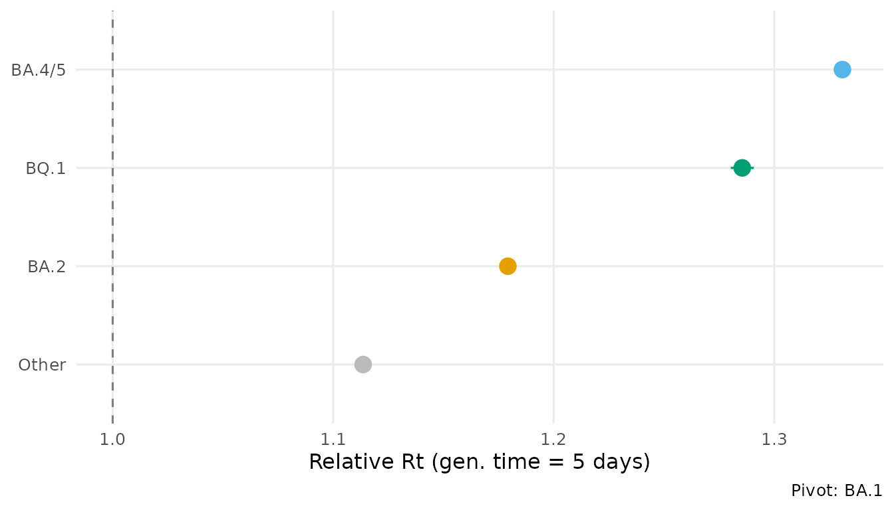
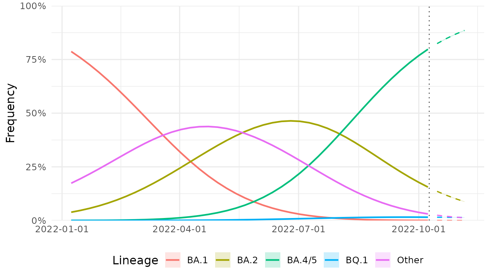

# Getting started with lineagefreq

## Overview

lineagefreq models pathogen lineage frequency dynamics from genomic
surveillance count data. Given a table of lineage-resolved sequence
counts over time, the package estimates relative growth advantages,
generates short-term frequency forecasts, and provides tools for
evaluating model accuracy.

This vignette demonstrates the core workflow using simulated SARS-CoV-2
surveillance data.

## Preparing data

The entry point is
[`lfq_data()`](https://cuiweig.github.io/lineagefreq/reference/lfq_data.md),
which validates and standardizes a count table. The minimum input is a
data frame with columns for date, lineage name, and sequence count.

``` r
library(lineagefreq)

data(sarscov2_us_2022)
head(sarscov2_us_2022)
#>         date variant count total
#> 1 2022-01-08    BA.1 11802 14929
#> 2 2022-01-08    BA.2   565 14929
#> 3 2022-01-08  BA.4/5     4 14929
#> 4 2022-01-08    BQ.1     0 14929
#> 5 2022-01-08   Other  2558 14929
#> 6 2022-01-15    BA.1 10342 13672
```

``` r
x <- lfq_data(sarscov2_us_2022,
              lineage = variant,
              date    = date,
              count   = count,
              total   = total)
x
#> 
#> ── Lineage frequency data
#> 5 lineages, 40 time points
#> Date range: 2022-01-08 to 2022-10-08
#> Lineages: "BA.1, BA.2, BA.4/5, BQ.1, Other"
#> 
#> # A tibble: 200 × 7
#>    .date      .lineage .count total .total    .freq .reliable
#>  * <date>     <chr>     <int> <int>  <int>    <dbl> <lgl>    
#>  1 2022-01-08 BA.1      11802 14929  14929 0.791    TRUE     
#>  2 2022-01-08 BA.2        565 14929  14929 0.0378   TRUE     
#>  3 2022-01-08 BA.4/5        4 14929  14929 0.000268 TRUE     
#>  4 2022-01-08 BQ.1          0 14929  14929 0        TRUE     
#>  5 2022-01-08 Other      2558 14929  14929 0.171    TRUE     
#>  6 2022-01-15 BA.1      10342 13672  13672 0.756    TRUE     
#>  7 2022-01-15 BA.2        608 13672  13672 0.0445   TRUE     
#>  8 2022-01-15 BA.4/5        3 13672  13672 0.000219 TRUE     
#>  9 2022-01-15 BQ.1          0 13672  13672 0        TRUE     
#> 10 2022-01-15 Other      2719 13672  13672 0.199    TRUE     
#> # ℹ 190 more rows
```

The function computes frequencies, flags low-count time points, and
returns a validated `lfq_data` object.

## Fitting a model

[`fit_model()`](https://cuiweig.github.io/lineagefreq/reference/fit_model.md)
provides a unified interface. The default engine is multinomial logistic
regression (MLR).

``` r
fit <- fit_model(x, engine = "mlr")
fit
#> Lineage frequency model (mlr)
#> 5 lineages, 40 time points
#> Date range: 2022-01-08 to 2022-10-08
#> Pivot: "BA.1"
#> 
#> Growth rates (per 7-day unit):
#>   ↑ BA.2: 0.2308
#>   ↑ BA.4/5: 0.4002
#>   ↑ BQ.1: 0.3516
#>   ↑ Other: 0.1506
#> 
#> AIC: 9e+05; BIC: 9e+05
```

The print output shows each lineage’s estimated growth rate relative to
the pivot (reference) lineage, which is auto-selected as the most
prevalent lineage early in the time series.

## Extracting growth advantages

[`growth_advantage()`](https://cuiweig.github.io/lineagefreq/reference/growth_advantage.md)
converts growth rates into interpretable metrics. Four output types are
available.

``` r
ga <- growth_advantage(fit,
                       type = "relative_Rt",
                       generation_time = 5)
ga
#> # A tibble: 5 × 6
#>   lineage estimate lower upper type        pivot
#>   <chr>      <dbl> <dbl> <dbl> <chr>       <chr>
#> 1 BA.1        1     1     1    relative_Rt BA.1 
#> 2 BA.2        1.18  1.18  1.18 relative_Rt BA.1 
#> 3 BA.4/5      1.33  1.33  1.33 relative_Rt BA.1 
#> 4 BQ.1        1.29  1.28  1.29 relative_Rt BA.1 
#> 5 Other       1.11  1.11  1.11 relative_Rt BA.1
```

A relative Rt above 1 indicates a lineage growing faster than the
reference. The confidence intervals are derived from the Fisher
information matrix.

## Visualizing the fit

[`autoplot()`](https://ggplot2.tidyverse.org/reference/autoplot.html)
supports four plot types for fitted models.

``` r
autoplot(fit, type = "frequency")
```



``` r
autoplot(fit, type = "advantage", generation_time = 5)
```



## Forecasting

[`forecast()`](https://cuiweig.github.io/lineagefreq/reference/forecast.md)
projects frequencies forward with uncertainty quantified by parametric
simulation.

``` r
fc <- forecast(fit, horizon = 28)
autoplot(fc)
#> Warning in ggplot2::scale_x_date(date_labels = "%Y-%m-%d"): A <numeric> value was passed to a Date scale.
#> ℹ The value was converted to a <Date> object.
```



## Detecting emerging lineages

[`summarize_emerging()`](https://cuiweig.github.io/lineagefreq/reference/summarize_emerging.md)
tests each lineage for statistically significant frequency increases.

``` r
summarize_emerging(x)
#> # A tibble: 4 × 10
#>   lineage first_seen last_seen  n_timepoints current_freq growth_rate p_value
#>   <chr>   <date>     <date>            <int>        <dbl>       <dbl>   <dbl>
#> 1 BA.2    2022-01-08 2022-10-08           40       0.156      0.00476       0
#> 2 BA.4/5  2022-01-08 2022-10-08           40       0.797      0.0293        0
#> 3 BQ.1    2022-01-08 2022-10-08           40       0.0176     0.0143        0
#> 4 Other   2022-01-08 2022-10-08           40       0.0293    -0.00489       0
#> # ℹ 3 more variables: p_adjusted <dbl>, significant <lgl>, direction <chr>
```

## Next steps

- Compare multiple engines with
  [`backtest()`](https://cuiweig.github.io/lineagefreq/reference/backtest.md)
  — see
  [`vignette("model-comparison")`](https://cuiweig.github.io/lineagefreq/articles/model-comparison.md).
- Run a full surveillance workflow — see
  [`vignette("surveillance-workflow")`](https://cuiweig.github.io/lineagefreq/articles/surveillance-workflow.md).
