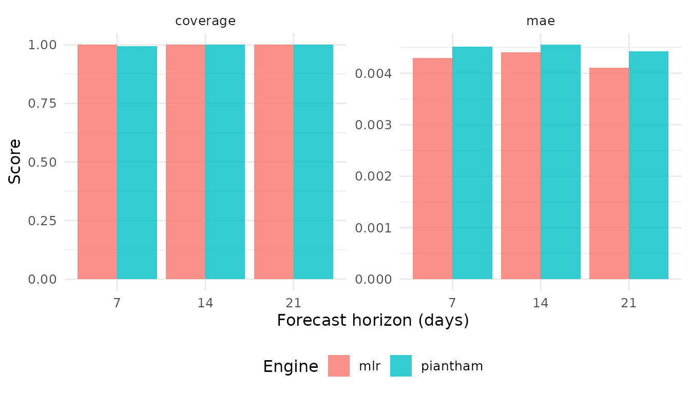

# Comparing modeling engines

## Overview

lineagefreq provides multiple modeling engines through the unified
[`fit_model()`](https://CuiweiG.github.io/lineagefreq/reference/fit_model.md)
interface. This vignette shows how to compare them using the built-in
backtesting framework.

Three engines are available in v0.1.0:

- **mlr**: Multinomial logistic regression (frequentist, fast).
- **piantham**: Converts MLR growth rates to relative reproduction
  numbers using a generation-time approximation.
- **hier_mlr**: Hierarchical MLR with partial pooling across locations
  via empirical Bayes shrinkage.

## Setup

``` r
library(lineagefreq)
```

## Engine 1: MLR

The default engine fits a multinomial logistic regression with one
growth rate parameter per non-reference lineage.

``` r
data(sarscov2_us_2022)
x <- lfq_data(sarscov2_us_2022,
              lineage = variant, date = date,
              count = count, total = total)

fit_mlr <- fit_model(x, engine = "mlr")
growth_advantage(fit_mlr, type = "growth_rate")
#> # A tibble: 5 × 6
#>   lineage estimate lower upper type        pivot
#>   <chr>      <dbl> <dbl> <dbl> <chr>       <chr>
#> 1 BA.1       0     0     0     growth_rate BA.1 
#> 2 BA.2       0.231 0.229 0.232 growth_rate BA.1 
#> 3 BA.4/5     0.400 0.398 0.402 growth_rate BA.1 
#> 4 BQ.1       0.352 0.346 0.357 growth_rate BA.1 
#> 5 Other      0.151 0.149 0.152 growth_rate BA.1
```

## Engine 2: Piantham

The Piantham engine wraps MLR and translates growth rates to relative
effective reproduction numbers using a specified mean generation time.

``` r
fit_pian <- fit_model(x, engine = "piantham",
                      generation_time = 5)
growth_advantage(fit_pian, type = "relative_Rt",
                 generation_time = 5)
#> # A tibble: 5 × 6
#>   lineage estimate lower upper type        pivot
#>   <chr>      <dbl> <dbl> <dbl> <chr>       <chr>
#> 1 BA.1        1     1     1    relative_Rt BA.1 
#> 2 BA.2        1.18  1.18  1.18 relative_Rt BA.1 
#> 3 BA.4/5      1.33  1.33  1.33 relative_Rt BA.1 
#> 4 BQ.1        1.29  1.28  1.29 relative_Rt BA.1 
#> 5 Other       1.11  1.11  1.11 relative_Rt BA.1
```

## Comparing fit statistics

`glance()` returns a one-row summary for each model. Since Piantham is a
wrapper around MLR, the log-likelihood and AIC are identical.

``` r
dplyr::bind_rows(
  glance.lfq_fit(fit_mlr),
  glance.lfq_fit(fit_pian)
)
#> # A tibble: 2 × 10
#>   engine   n_lineages n_timepoints   nobs    df   logLik     AIC     BIC pivot
#>   <chr>         <int>        <int>  <int> <int>    <dbl>   <dbl>   <dbl> <chr>
#> 1 mlr               5           40 461424     8 -465911. 931838. 931852. BA.1 
#> 2 piantham          5           40 461424     8 -465911. 931838. 931852. BA.1 
#> # ℹ 1 more variable: convergence <int>
```

## Backtesting

The
[`backtest()`](https://CuiweiG.github.io/lineagefreq/reference/backtest.md)
function implements rolling-origin evaluation. At each origin date, the
model is fit on past data and forecasts are compared to held-out future
observations.

``` r
bt <- backtest(x,
  engines = c("mlr", "piantham"),
  horizons = c(7, 14, 21),
  min_train = 56,
  generation_time = 5
)
#> Backtesting ■■■                                7% | ETA: 15s
#> Backtesting ■■■■■■■                           22% | ETA: 13s
#> Backtesting ■■■■■■■■■■■■                      38% | ETA: 11s
#> Backtesting ■■■■■■■■■■■■■■■■                  51% | ETA: 10s
#> Backtesting ■■■■■■■■■■■■■■■■■■■■              63% | ETA:  7s
#> Backtesting ■■■■■■■■■■■■■■■■■■■■■■■           75% | ETA:  5s
#> Backtesting ■■■■■■■■■■■■■■■■■■■■■■■■■■■       86% | ETA:  3s
#> Backtesting ■■■■■■■■■■■■■■■■■■■■■■■■■■■■■■    96% | ETA:  1s
#> Backtesting ■■■■■■■■■■■■■■■■■■■■■■■■■■■■■■■  100% | ETA:  0s
bt
#> 
#> ── Backtest results
#> 900 predictions across 31 origins
#> Engines: "mlr, piantham"
#> Horizons: 7, 14, 21 days
#> 
#> # A tibble: 900 × 9
#>    origin_date target_date horizon engine lineage predicted lower  upper
#>  * <date>      <date>        <int> <chr>  <chr>       <dbl> <dbl>  <dbl>
#>  1 2022-03-05  2022-03-12        7 mlr    BA.1         0.44  0.34 0.535 
#>  2 2022-03-05  2022-03-12        7 mlr    BA.2         0.18  0.11 0.26  
#>  3 2022-03-05  2022-03-12        7 mlr    BA.4/5       0     0    0.02  
#>  4 2022-03-05  2022-03-12        7 mlr    BQ.1         0     0    0.01  
#>  5 2022-03-05  2022-03-12        7 mlr    Other        0.37  0.27 0.47  
#>  6 2022-03-05  2022-03-19       14 mlr    BA.1         0.39  0.3  0.495 
#>  7 2022-03-05  2022-03-19       14 mlr    BA.2         0.2   0.12 0.29  
#>  8 2022-03-05  2022-03-19       14 mlr    BA.4/5       0     0    0.0252
#>  9 2022-03-05  2022-03-19       14 mlr    BQ.1         0     0    0.01  
#> 10 2022-03-05  2022-03-19       14 mlr    Other        0.39  0.3  0.49  
#> # ℹ 890 more rows
#> # ℹ 1 more variable: observed <dbl>
```

## Scoring

[`score_forecasts()`](https://CuiweiG.github.io/lineagefreq/reference/score_forecasts.md)
computes standardized accuracy metrics.

``` r
sc <- score_forecasts(bt,
  metrics = c("mae", "coverage"))
sc
#> # A tibble: 12 × 4
#>    engine   horizon metric     value
#>    <chr>      <int> <chr>      <dbl>
#>  1 mlr            7 mae      0.00429
#>  2 mlr            7 coverage 1      
#>  3 mlr           14 mae      0.00441
#>  4 mlr           14 coverage 1      
#>  5 mlr           21 mae      0.00411
#>  6 mlr           21 coverage 1      
#>  7 piantham       7 mae      0.00452
#>  8 piantham       7 coverage 0.994  
#>  9 piantham      14 mae      0.00455
#> 10 piantham      14 coverage 1      
#> 11 piantham      21 mae      0.00442
#> 12 piantham      21 coverage 1
```

## Model ranking

[`compare_models()`](https://CuiweiG.github.io/lineagefreq/reference/compare_models.md)
summarizes scores per engine, sorted by MAE.

``` r
compare_models(sc, by = c("engine", "horizon"))
#> # A tibble: 6 × 4
#>   engine   horizon     mae coverage
#>   <chr>      <int>   <dbl>    <dbl>
#> 1 mlr           21 0.00411    1    
#> 2 mlr            7 0.00429    1    
#> 3 mlr           14 0.00441    1    
#> 4 piantham      21 0.00442    1    
#> 5 piantham       7 0.00452    0.994
#> 6 piantham      14 0.00455    1
```

## Visualization

``` r
plot_backtest(sc)
```



## When to use which engine

| Scenario                        | Recommended engine |
|---------------------------------|--------------------|
| Single location, quick estimate | `mlr`              |
| Need relative Rt interpretation | `piantham`         |
| Multiple locations, sparse data | `hier_mlr`         |
| Time-varying fitness (v0.2)     | `garw`             |

## Hierarchical MLR

When data spans multiple locations with unequal sequencing depth,
`hier_mlr` shrinks location-specific estimates toward the global mean.
This stabilizes estimates for low-data locations.

A demonstration requires multi-location data, which the built-in
single-location dataset does not provide. See
[`?fit_model`](https://CuiweiG.github.io/lineagefreq/reference/fit_model.md)
for an example with simulated multi-location data.
