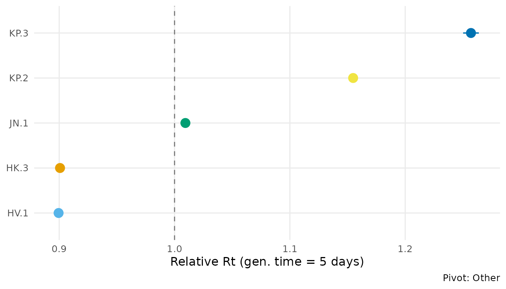
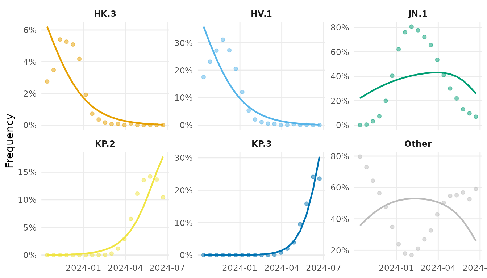
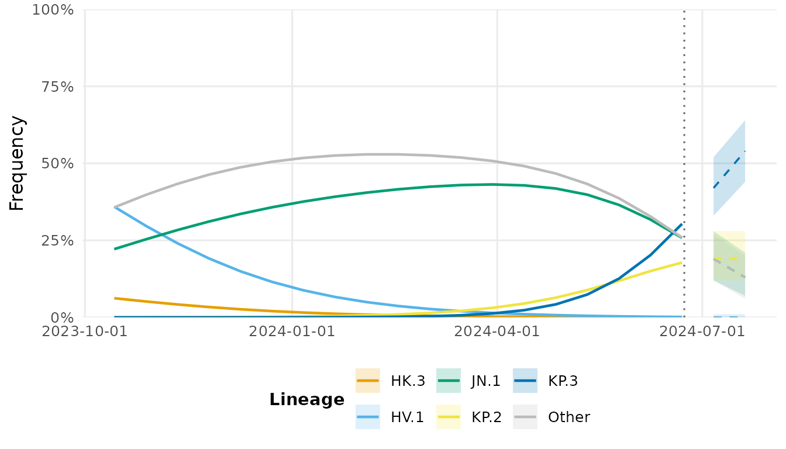

# Analyzing real CDC surveillance data

## Overview

This vignette demonstrates the complete lineagefreq workflow on **real
surveillance data** from the U.S. CDC. The built-in dataset
`cdc_sarscov2_jn1` contains actual weighted variant proportion estimates
from CDC’s national genomic surveillance program, covering the JN.1
emergence wave (October 2023 to June 2024).

## Load data

``` r
library(lineagefreq)

data(cdc_sarscov2_jn1)
str(cdc_sarscov2_jn1)
#> 'data.frame':    171 obs. of  4 variables:
#>  $ date      : Date, format: "2023-10-14" "2023-10-14" ...
#>  $ lineage   : chr  "BA.2.86" "HK.3" "HV.1" "JN.1" ...
#>  $ count     : int  26 220 1401 10 0 0 0 6158 185 63 ...
#>  $ proportion: num  0.0032 0.0275 0.17508 0.00126 0 ...
```

``` r
vd <- lfq_data(cdc_sarscov2_jn1,
               lineage = lineage, date = date, count = count)
vd
#> 
#> ── Lineage frequency data
#> 9 lineages, 19 time points
#> Date range: 2023-10-14 to 2024-06-22
#> Lineages: "BA.2.86, HK.3, HV.1, JN.1, JN.1.11.1", ...
#> 
#> # A tibble: 171 × 7
#>    .date      .lineage  .count proportion .total   .freq .reliable
#>  * <date>     <chr>      <int>      <dbl>  <int>   <dbl> <lgl>    
#>  1 2023-10-14 BA.2.86       26    0.00320   8000 0.00325 TRUE     
#>  2 2023-10-14 HK.3         220    0.0275    8000 0.0275  TRUE     
#>  3 2023-10-14 HV.1        1401    0.175     8000 0.175   TRUE     
#>  4 2023-10-14 JN.1          10    0.00126   8000 0.00125 TRUE     
#>  5 2023-10-14 JN.1.11.1      0    0         8000 0       TRUE     
#>  6 2023-10-14 KP.2           0    0         8000 0       TRUE     
#>  7 2023-10-14 KP.3           0    0         8000 0       TRUE     
#>  8 2023-10-14 Other       6158    0.770     8000 0.770   TRUE     
#>  9 2023-10-14 XBB.1.5      185    0.0232    8000 0.0231  TRUE     
#> 10 2023-10-28 BA.2.86       63    0.00793   8000 0.00788 TRUE     
#> # ℹ 161 more rows
```

## Collapse rare lineages

During JN.1’s rise, several lineages circulated at low frequency. We
collapse those below 5% peak frequency into “Other”.

``` r
vd_clean <- collapse_lineages(vd, min_freq = 0.05)
#> Collapsing 3 rare lineages into "Other".
attr(vd_clean, "lineages")
#> [1] "HK.3"  "HV.1"  "JN.1"  "KP.2"  "KP.3"  "Other"
```

## Fit MLR model

``` r
fit <- fit_model(vd_clean, engine = "mlr")
fit
#> Lineage frequency model (mlr)
#> 6 lineages, 19 time points
#> Date range: 2023-10-14 to 2024-06-22
#> Pivot: "Other"
#> 
#> Growth rates (per 7-day unit):
#>   ↓ HK.3: -0.1464
#>   ↓ HV.1: -0.1483
#>   ↑ JN.1: 0.01312
#>   ↑ KP.2: 0.2016
#>   ↑ KP.3: 0.3202
#> 
#> AIC: 3e+05; BIC: 3e+05
```

## Growth advantages

``` r
ga <- growth_advantage(fit, type = "relative_Rt",
                       generation_time = 5)
ga
#> # A tibble: 6 × 6
#>   lineage estimate lower upper type        pivot
#>   <chr>      <dbl> <dbl> <dbl> <chr>       <chr>
#> 1 HK.3       0.901 0.897 0.905 relative_Rt Other
#> 2 HV.1       0.899 0.898 0.901 relative_Rt Other
#> 3 JN.1       1.01  1.01  1.01  relative_Rt Other
#> 4 KP.2       1.15  1.15  1.16  relative_Rt Other
#> 5 KP.3       1.26  1.25  1.26  relative_Rt Other
#> 6 Other      1     1     1     relative_Rt Other
```

``` r
autoplot(fit, type = "advantage", generation_time = 5)
```



JN.1 shows a strong growth advantage over previously circulating
XBB-derived lineages, consistent with published CDC estimates.

## Frequency trajectories

``` r
autoplot(fit, type = "trajectory")
```



## Forecast

``` r
fc <- forecast(fit, horizon = 28)
autoplot(fc)
#> Warning in ggplot2::scale_x_date(date_labels = "%Y-%m-%d"): A <numeric> value was passed to a Date scale.
#> ℹ The value was converted to a <Date> object.
```



## Emergence detection

``` r
summarize_emerging(vd_clean)
#> # A tibble: 4 × 10
#>   lineage first_seen last_seen  n_timepoints current_freq growth_rate   p_value
#>   <chr>   <date>     <date>            <int>        <dbl>       <dbl>     <dbl>
#> 1 KP.2    2023-10-14 2024-06-22           19       0.104      0.0250  0        
#> 2 KP.3    2023-10-14 2024-06-22           19       0.236      0.0419  0        
#> 3 JN.1    2023-10-14 2024-06-22           19       0.0694     0.00158 2.28e-113
#> 4 Other   2023-10-14 2024-06-22           19       0.590     -0.00109 3.43e- 59
#> # ℹ 3 more variables: p_adjusted <dbl>, significant <lgl>, direction <chr>
```

## Sequencing power

How many sequences per week are needed to detect a variant at 1%?

``` r
sequencing_power(
  target_precision = 0.05,
  current_freq = c(0.01, 0.02, 0.05)
)
#> # A tibble: 3 × 4
#>   current_freq target_precision required_n ci_level
#>          <dbl>            <dbl>      <dbl>    <dbl>
#> 1         0.01             0.05         16     0.95
#> 2         0.02             0.05         31     0.95
#> 3         0.05             0.05         73     0.95
```

## Session info

``` r
sessionInfo()
#> R version 4.5.3 (2026-03-11)
#> Platform: x86_64-pc-linux-gnu
#> Running under: Ubuntu 24.04.4 LTS
#> 
#> Matrix products: default
#> BLAS:   /usr/lib/x86_64-linux-gnu/openblas-pthread/libblas.so.3 
#> LAPACK: /usr/lib/x86_64-linux-gnu/openblas-pthread/libopenblasp-r0.3.26.so;  LAPACK version 3.12.0
#> 
#> locale:
#>  [1] LC_CTYPE=C.UTF-8       LC_NUMERIC=C           LC_TIME=C.UTF-8       
#>  [4] LC_COLLATE=C.UTF-8     LC_MONETARY=C.UTF-8    LC_MESSAGES=C.UTF-8   
#>  [7] LC_PAPER=C.UTF-8       LC_NAME=C              LC_ADDRESS=C          
#> [10] LC_TELEPHONE=C         LC_MEASUREMENT=C.UTF-8 LC_IDENTIFICATION=C   
#> 
#> time zone: UTC
#> tzcode source: system (glibc)
#> 
#> attached base packages:
#> [1] stats     graphics  grDevices utils     datasets  methods   base     
#> 
#> other attached packages:
#> [1] lineagefreq_0.2.0
#> 
#> loaded via a namespace (and not attached):
#>  [1] gtable_0.3.6       jsonlite_2.0.0     dplyr_1.2.1        compiler_4.5.3    
#>  [5] tidyselect_1.2.1   tidyr_1.3.2        jquerylib_0.1.4    systemfonts_1.3.2 
#>  [9] scales_1.4.0       textshaping_1.0.5  yaml_2.3.12        fastmap_1.2.0     
#> [13] ggplot2_4.0.2      R6_2.6.1           labeling_0.4.3     generics_0.1.4    
#> [17] knitr_1.51         MASS_7.3-65        tibble_3.3.1       desc_1.4.3        
#> [21] bslib_0.10.0       pillar_1.11.1      RColorBrewer_1.1-3 rlang_1.2.0       
#> [25] utf8_1.2.6         cachem_1.1.0       xfun_0.57          fs_2.0.1          
#> [29] sass_0.4.10        S7_0.2.1           cli_3.6.6          pkgdown_2.2.0     
#> [33] withr_3.0.2        magrittr_2.0.5     digest_0.6.39      grid_4.5.3        
#> [37] lifecycle_1.0.5    vctrs_0.7.2        evaluate_1.0.5     glue_1.8.0        
#> [41] farver_2.1.2       ragg_1.5.2         rmarkdown_2.31     purrr_1.2.2       
#> [45] tools_4.5.3        pkgconfig_2.0.3    htmltools_0.5.9
```
