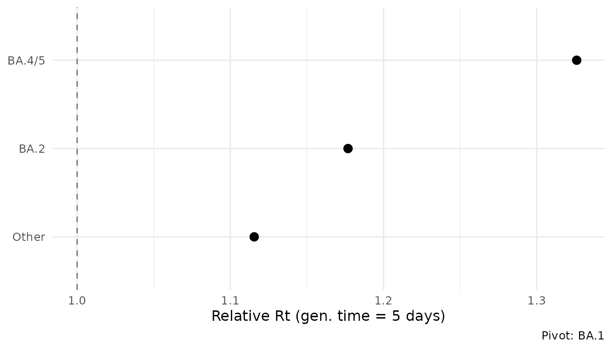
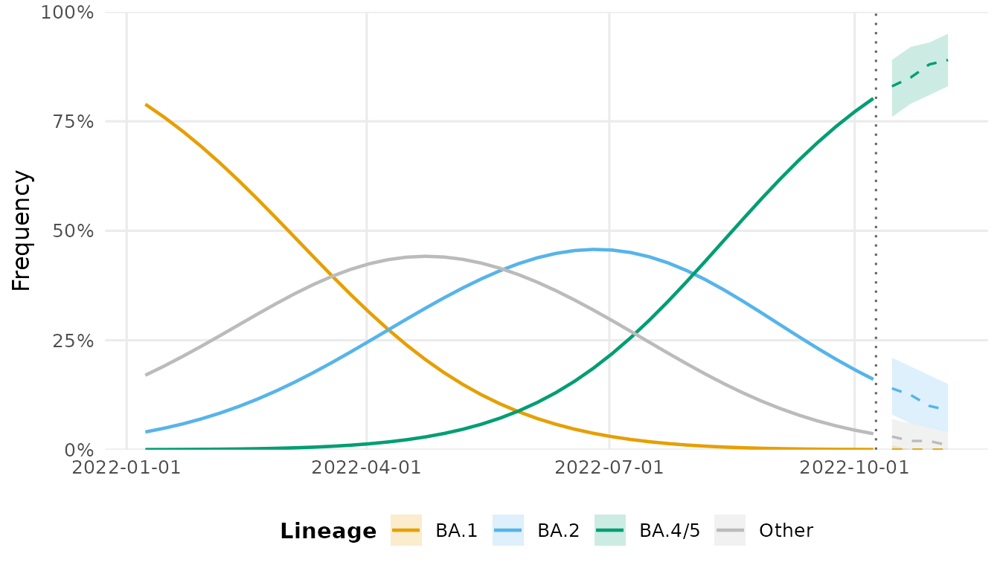

# Surveillance workflow

## Overview

This vignette demonstrates a complete end-to-end surveillance analysis:
from raw count data to actionable outputs. The workflow mirrors what a
public health genomics team would run weekly.

## Step 1: Load and prepare data

``` r
library(lineagefreq)

data(sarscov2_us_2022)
x <- lfq_data(sarscov2_us_2022,
              lineage = variant,
              date    = date,
              count   = count,
              total   = total)
```

## Step 2: Collapse rare lineages

Real surveillance data often contains dozens of low-frequency lineages.
[`collapse_lineages()`](https://cuiweig.github.io/lineagefreq/reference/collapse_lineages.md)
merges those below a threshold into an “Other” category.

``` r
x_clean <- collapse_lineages(x, min_freq = 0.02)
#> Collapsing 1 rare lineage into "Other".
attr(x_clean, "lineages")
#> [1] "BA.1"   "BA.2"   "BA.4/5" "Other"
```

## Step 3: Fit model

``` r
fit <- fit_model(x_clean, engine = "mlr")
summary(fit)
#> Lineage Frequency Model Summary
#> ================================
#> Engine:       mlr 
#> Pivot:        BA.1 
#> Lineages:     4 
#> Time points:  40 
#> Total seqs:   461424 
#> Parameters:   6 
#> Log-lik:      -455671 
#> AIC:          911355 
#> BIC:          911365 
#> 
#> Growth rates (per 7 days):
#> # A tibble: 4 × 6
#>   lineage estimate lower upper type        pivot
#>   <chr>      <dbl> <dbl> <dbl> <chr>       <chr>
#> 1 BA.1       0     0     0     growth_rate BA.1 
#> 2 BA.2       0.228 0.226 0.229 growth_rate BA.1 
#> 3 BA.4/5     0.395 0.393 0.397 growth_rate BA.1 
#> 4 Other      0.153 0.152 0.154 growth_rate BA.1
```

## Step 4: Growth advantages

``` r
ga <- growth_advantage(fit,
                       type = "relative_Rt",
                       generation_time = 5)
ga
#> # A tibble: 4 × 6
#>   lineage estimate lower upper type        pivot
#>   <chr>      <dbl> <dbl> <dbl> <chr>       <chr>
#> 1 BA.1        1     1     1    relative_Rt BA.1 
#> 2 BA.2        1.18  1.18  1.18 relative_Rt BA.1 
#> 3 BA.4/5      1.33  1.32  1.33 relative_Rt BA.1 
#> 4 Other       1.12  1.11  1.12 relative_Rt BA.1
```

``` r
autoplot(fit, type = "advantage", generation_time = 5)
```



## Step 5: Identify emerging lineages

``` r
emerging <- summarize_emerging(x_clean)
emerging[emerging$significant, ]
#> # A tibble: 3 × 10
#>   lineage first_seen last_seen  n_timepoints current_freq growth_rate p_value
#>   <chr>   <date>     <date>            <int>        <dbl>       <dbl>   <dbl>
#> 1 BA.2    2022-01-08 2022-10-08           40       0.156      0.00476       0
#> 2 BA.4/5  2022-01-08 2022-10-08           40       0.797      0.0293        0
#> 3 Other   2022-01-08 2022-10-08           40       0.0469    -0.00442       0
#> # ℹ 3 more variables: p_adjusted <dbl>, significant <lgl>, direction <chr>
```

## Step 6: Forecast

``` r
fc <- forecast(fit, horizon = 28)
autoplot(fc)
#> Warning in ggplot2::scale_x_date(date_labels = "%Y-%m-%d"): A <numeric> value was passed to a Date scale.
#> ℹ The value was converted to a <Date> object.
```



## Step 7: Assess sequencing needs

How many sequences are needed to reliably detect a lineage at 2%
frequency?

``` r
sequencing_power(
  target_precision = 0.05,
  current_freq = c(0.01, 0.02, 0.05, 0.10)
)
#> # A tibble: 4 × 4
#>   current_freq target_precision required_n ci_level
#>          <dbl>            <dbl>      <dbl>    <dbl>
#> 1         0.01             0.05         16     0.95
#> 2         0.02             0.05         31     0.95
#> 3         0.05             0.05         73     0.95
#> 4         0.1              0.05        139     0.95
```

## Step 8: Extract tidy results

All results are compatible with the broom ecosystem.

``` r
tidy.lfq_fit(fit)
#> # A tibble: 6 × 6
#>   lineage term        estimate std.error conf.low conf.high
#>   <chr>   <chr>          <dbl>     <dbl>    <dbl>     <dbl>
#> 1 BA.2    intercept     -2.97   0.0109     -2.99     -2.95 
#> 2 BA.2    growth_rate    0.228  0.000750    0.226     0.229
#> 3 BA.4/5  intercept     -7.88   0.0238     -7.93     -7.83 
#> 4 BA.4/5  growth_rate    0.395  0.00103     0.393     0.397
#> 5 Other   intercept     -1.53   0.00823    -1.55     -1.52 
#> 6 Other   growth_rate    0.153  0.000677    0.152     0.154
glance.lfq_fit(fit)
#> # A tibble: 1 × 10
#>   engine n_lineages n_timepoints   nobs    df   logLik     AIC     BIC pivot
#>   <chr>       <int>        <int>  <int> <int>    <dbl>   <dbl>   <dbl> <chr>
#> 1 mlr             4           40 461424     6 -455671. 911355. 911365. BA.1 
#> # ℹ 1 more variable: convergence <int>
```

## Summary

A typical weekly workflow:

1.  [`lfq_data()`](https://cuiweig.github.io/lineagefreq/reference/lfq_data.md)
    — ingest new counts
2.  [`collapse_lineages()`](https://cuiweig.github.io/lineagefreq/reference/collapse_lineages.md)
    — clean up rare lineages
3.  [`fit_model()`](https://cuiweig.github.io/lineagefreq/reference/fit_model.md)
    — estimate dynamics
4.  [`summarize_emerging()`](https://cuiweig.github.io/lineagefreq/reference/summarize_emerging.md)
    — flag growing lineages
5.  [`forecast()`](https://cuiweig.github.io/lineagefreq/reference/forecast.md)
    — project forward 4 weeks
6.  [`autoplot()`](https://ggplot2.tidyverse.org/reference/autoplot.html)
    — generate report figures
