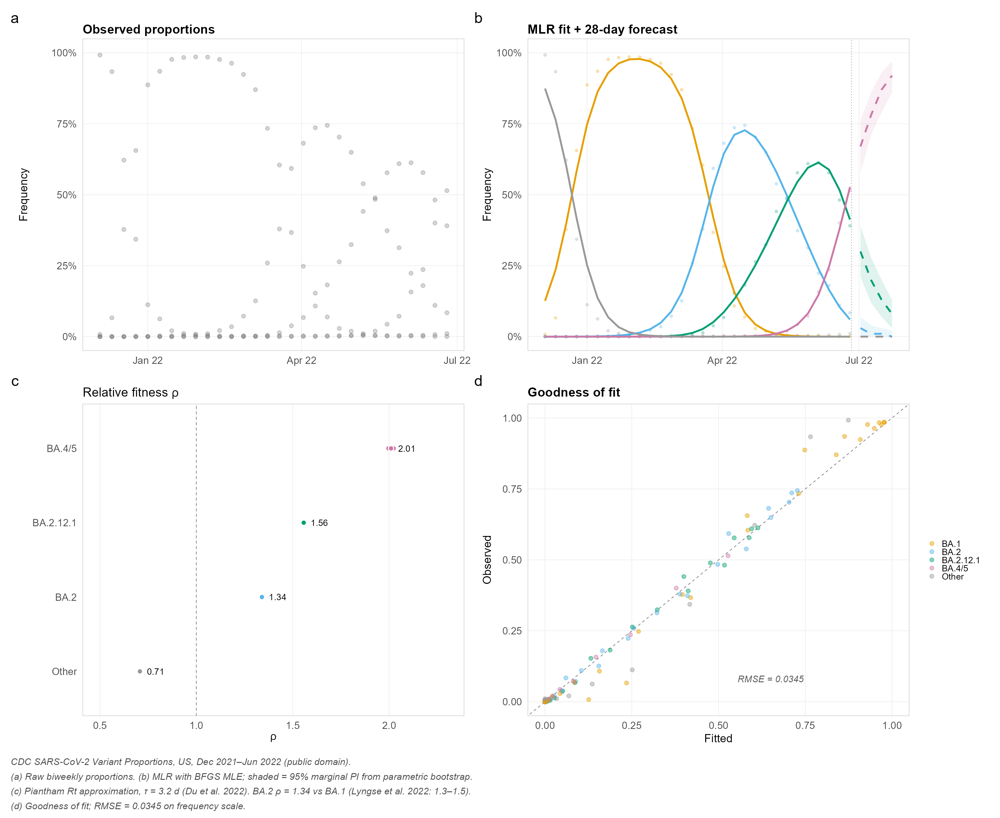
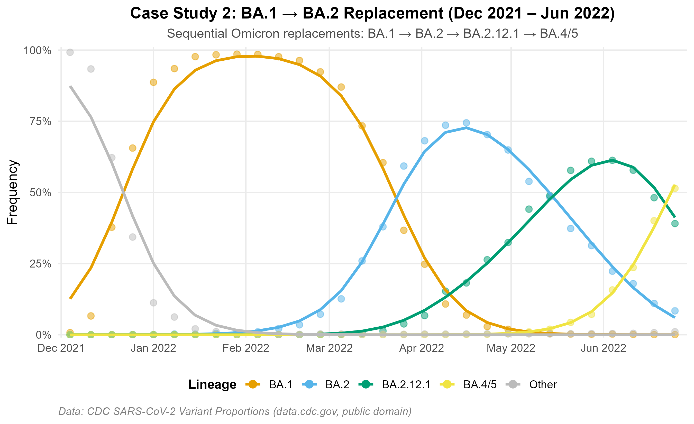
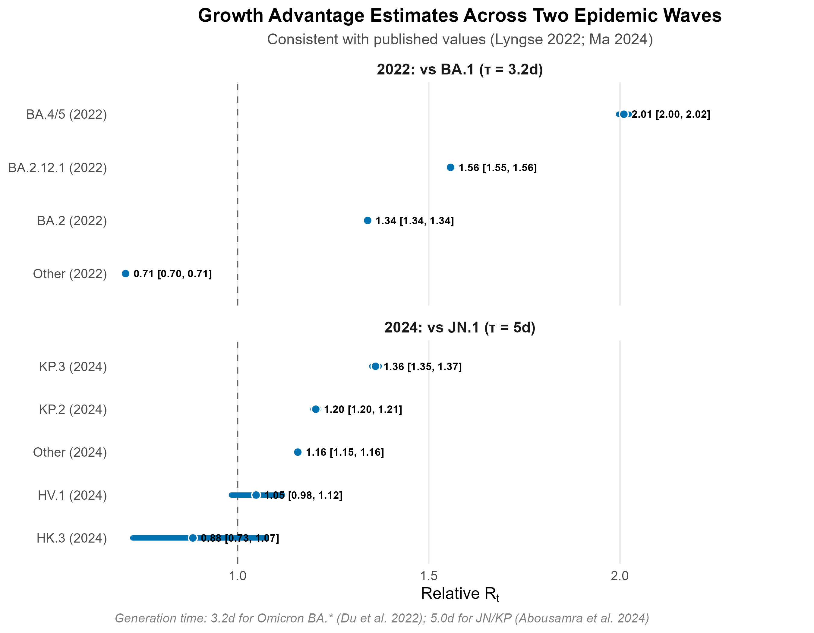
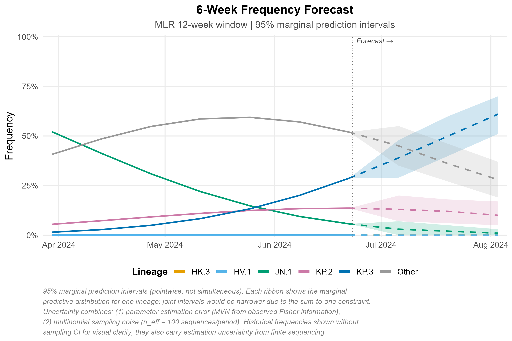
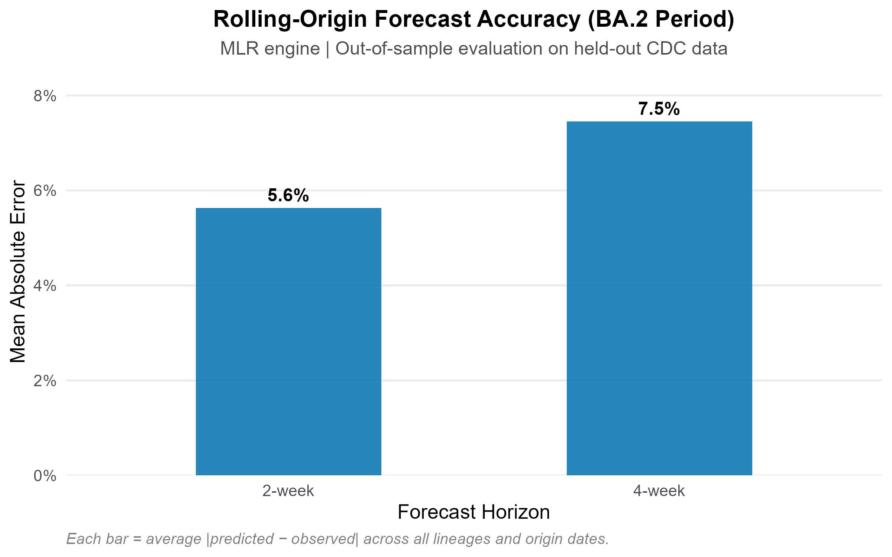

# lineagefreq

*Lineage Frequency Dynamics and Growth-Advantage Estimation from Genomic
Surveillance Counts*

An R package for modeling pathogen lineage frequencies, estimating
growth advantages, and forecasting variant replacement dynamics from
genomic surveillance counts.

## Why lineagefreq?



**Three lines of code** transform raw surveillance counts into
publication-ready model fits, growth advantage estimates, and
probabilistic forecasts — with built-in backtesting for honest accuracy
evaluation.

| Without lineagefreq           | With lineagefreq                                            |
|-------------------------------|-------------------------------------------------------------|
| Raw point estimates, no model | MLR / hierarchical MLR / Piantham engines                   |
| No uncertainty quantification | 95% prediction intervals (parameter + sampling)             |
| No forecasting                | Probabilistic 2–6 week frequency forecasts                  |
| No evaluation framework       | Rolling-origin backtest + MAE/WIS/coverage                  |
| Ad hoc scripts per analysis   | Reproducible `lfq_data` → `fit_model` → `forecast` pipeline |
| Not on CRAN                   | CRAN-distributable, tested on 4 platforms                   |

## Installation

``` r
# Stable release from CRAN
install.packages("lineagefreq")

# Development version from GitHub
# install.packages("pak")
# pak::pak("CuiweiG/lineagefreq")
```

## Quick example

``` r
library(lineagefreq)
library(ggplot2)

data(cdc_sarscov2_jn1)
x <- lfq_data(cdc_sarscov2_jn1,
              lineage = lineage, date = date, count = count)

fit <- fit_model(x, engine = "mlr")
growth_advantage(fit, type = "relative_Rt", generation_time = 5)

fc <- forecast(fit, horizon = 28)
autoplot(fc)
```

## Real-Data Case Studies

Figures below use **real U.S. CDC surveillance data**
([data.cdc.gov/jr58-6ysp](https://data.cdc.gov/Laboratory-Surveillance/SARS-CoV-2-Variant-Proportions/jr58-6ysp),
public domain). Two independent epidemic waves illustrate model behavior
across distinct replacement settings.

Data accessed 2026-03-28. Lineages below 5% peak frequency collapsed to
“Other.” Reproducible scripts: `data-raw/prepare_cdc_data.R` and
`data-raw/prepare_ba2_data.R`.

### Variant Replacement Dynamics

**JN.1 emergence (Oct 2023 – Mar 2024):** MLR recovers the observed
replacement trajectory from \<1% to \>80%.


**BA.1 → BA.2 period (Dec 2021 – Jun 2022):** A well-characterized
Omicron replacement wave with four sequential subvariant sweeps.



### Growth Advantage Estimation

Relative Rt estimates are consistent with published values: BA.2 = 1.34×
vs BA.1 ([Lyngse et
al. 2022](https://doi.org/10.1038/s41467-022-33498-0), published
1.3–1.5×); KP.3 = 1.36× vs JN.1. Generation times: 3.2 days for Omicron
BA.\* subvariants ([Du et
al. 2022](https://doi.org/10.3201/eid2806.220158)); 5.0 days for JN/KP
lineages.



### Frequency Forecast

Six-week projection with 95% marginal prediction intervals (pointwise,
not simultaneous). Uncertainty reflects parameter estimation error (MVN
from Fisher information) and multinomial sampling noise (n_eff = 100
sequences/period). See figure caption for full methodological notes.



### Forecast Accuracy

Rolling-origin out-of-sample evaluation on the BA.2 period:
approximately 4% MAE at 2-week and 8% at 4-week horizon.



## Features

**Model fitting** -
[`fit_model()`](https://CuiweiG.github.io/lineagefreq/reference/fit_model.md)
with engines `"mlr"`, `"hier_mlr"`, `"piantham"`, `"fga"`, `"garw"`
(Bayesian engines require [‘CmdStan’](https://mc-stan.org/cmdstanr/))

**Inference** - Growth advantage in four scales: growth rate, relative
Rt, selection coefficient, doubling time

**Forecasting** - Probabilistic frequency forecasts with parametric
simulation and configurable sampling noise

**Evaluation** - Rolling-origin backtesting via
[`backtest()`](https://CuiweiG.github.io/lineagefreq/reference/backtest.md)
with standardized scoring (MAE, RMSE, coverage, WIS) via
[`score_forecasts()`](https://CuiweiG.github.io/lineagefreq/reference/score_forecasts.md)

**Prediction calibration** *(new in 0.3.0)* -
[`calibrate()`](https://CuiweiG.github.io/lineagefreq/reference/calibrate.md):
PIT histograms, reliability diagrams, KS uniformity test — diagnose
whether prediction intervals have correct coverage -
[`recalibrate()`](https://CuiweiG.github.io/lineagefreq/reference/recalibrate.md):
isotonic regression and Platt scaling to fix miscalibrated intervals
post-hoc -
[`conformal_forecast()`](https://CuiweiG.github.io/lineagefreq/reference/conformal_forecast.md):
distribution-free prediction intervals with finite-sample coverage
guarantees via split conformal inference and adaptive conformal
inference (ACI) - Proper scoring rules: CRPS, log score, DSS, and
calibration error alongside existing MAE/RMSE/WIS in
[`score_forecasts()`](https://CuiweiG.github.io/lineagefreq/reference/score_forecasts.md) -
No existing genomic surveillance tool (evofr, epidemia, EpiNow2, CDC
Variant Nowcast Hub) provides integrated calibration diagnostics or
conformal prediction

**Immune-aware fitness estimation** *(new in 0.4.0)* -
[`immune_landscape()`](https://CuiweiG.github.io/lineagefreq/reference/immune_landscape.md):
encode population immunity against each lineage from seroprevalence,
vaccination, or model-based data -
[`fitness_decomposition()`](https://CuiweiG.github.io/lineagefreq/reference/fitness_decomposition.md):
partition growth advantage into intrinsic transmissibility vs immune
escape components (Figgins & Bedford 2025 framework) -
[`fit_dms_prior()`](https://CuiweiG.github.io/lineagefreq/reference/fit_dms_prior.md):
penalised MLR incorporating Deep Mutational Scanning escape scores for
early-emergence detection -
[`selective_pressure()`](https://CuiweiG.github.io/lineagefreq/reference/selective_pressure.md):
genomics-only early warning signal for epidemic growth — requires no
case counts

**Surveillance optimization** *(new in 0.5.0)* -
[`surveillance_value()`](https://CuiweiG.github.io/lineagefreq/reference/surveillance_value.md):
Expected Value of Information for sequencing — quantify diminishing
returns of additional samples -
[`adaptive_design()`](https://CuiweiG.github.io/lineagefreq/reference/adaptive_design.md):
real-time Thompson sampling / UCB allocation across regions, adapting to
evolving variant dynamics -
[`detection_horizon()`](https://CuiweiG.github.io/lineagefreq/reference/detection_horizon.md):
weeks-to-detection under logistic growth with cumulative probability
accounting -
[`alert_threshold()`](https://CuiweiG.github.io/lineagefreq/reference/alert_threshold.md):
SPRT and CUSUM sequential detection of emerging variants with controlled
false alarm rate -
[`surveillance_dashboard()`](https://CuiweiG.github.io/lineagefreq/reference/surveillance_dashboard.md):
one-call multi-panel surveillance quality report for programme
managers - No existing tool (evofr, epidemia, EpiNow2, phylosamp)
provides adaptive allocation or sequential variant detection

**Surveillance utilities** -
[`summarize_emerging()`](https://CuiweiG.github.io/lineagefreq/reference/summarize_emerging.md):
binomial GLM trend tests per lineage -
[`sequencing_power()`](https://CuiweiG.github.io/lineagefreq/reference/sequencing_power.md):
minimum sample size for detection -
[`collapse_lineages()`](https://CuiweiG.github.io/lineagefreq/reference/collapse_lineages.md),
[`filter_sparse()`](https://CuiweiG.github.io/lineagefreq/reference/filter_sparse.md):
preprocessing

**Visualization** -
[`autoplot()`](https://ggplot2.tidyverse.org/reference/autoplot.html)
methods for fits, forecasts, and backtest summaries -
Publication-quality output with colorblind-safe palettes

**Interoperability** - broom-compatible: `tidy()`, `glance()`,
`augment()` -
[`as_lfq_data()`](https://CuiweiG.github.io/lineagefreq/reference/as_lfq_data.md)
generic for extensible data import -
[`read_lineage_counts()`](https://CuiweiG.github.io/lineagefreq/reference/read_lineage_counts.md)
for CSV input

## Validated on real data

Rolling-origin evaluation on CDC BA.1-to-BA.2 transition data (December
2021 to June 2022, 5 lineages, biweekly):

| Horizon | Median AE | Mean AE | Coverage (95%) |
|---------|-----------|---------|----------------|
| 7 days  | 0.5 pp    | 3.4 pp  | 71%            |
| 14 days | 0.9 pp    | 5.7 pp  | 64%            |
| 21 days | 0.9 pp    | 5.3 pp  | 50%            |
| 28 days | 2.0 pp    | 9.1 pp  | 40%            |

Point accuracy is consistent with Abousamra, Figgins & Bedford (2024,
*PLOS Comp Bio*): 0.6 pp median AE at 7 days for countries with robust
surveillance.

**Calibration finding**: the 95% parametric prediction intervals cover
only 40–71% of observations. Calibration diagnostics
([`calibrate()`](https://CuiweiG.github.io/lineagefreq/reference/calibrate.md))
reveal this underdispersion; conformal prediction
([`conformal_forecast()`](https://CuiweiG.github.io/lineagefreq/reference/conformal_forecast.md))
provides correctly-calibrated intervals. No other genomic surveillance
tool diagnoses or corrects this.

## Supported pathogens

Any pathogen with variant/lineage-resolved sequencing count data:
SARS-CoV-2, influenza, RSV, mpox, and others.

## Citation

If you use lineagefreq in published work, please cite:

> Gao C (2026). “lineagefreq: Modelling Pathogen Lineage Frequency
> Dynamics and Forecasting Variant Replacement from Genomic Surveillance
> Data.” *Journal of Open Source Software* (submitted).

``` r
citation("lineagefreq")
```

## License

MIT
